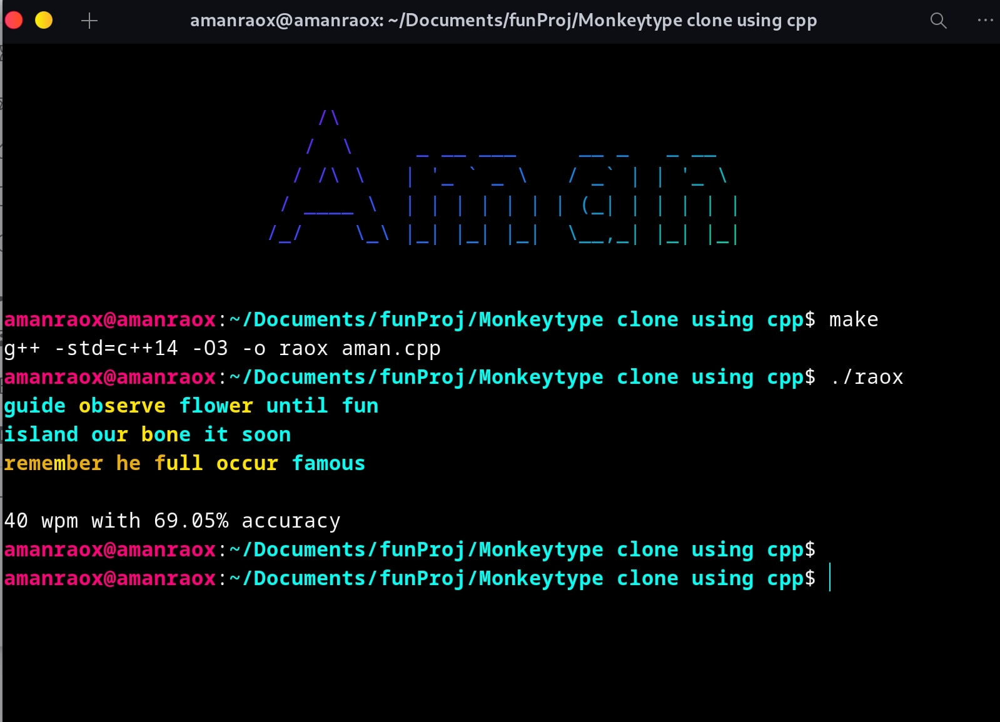

# MonkeyType in Terminal
simple program for speed typing enthusiast inspired by @monkeytype with good gui elements using C++ only.

Its like monkeytype but in Terminal.

# Run
- Clone the repository
- run `make`
- run `./raox`

## ss

